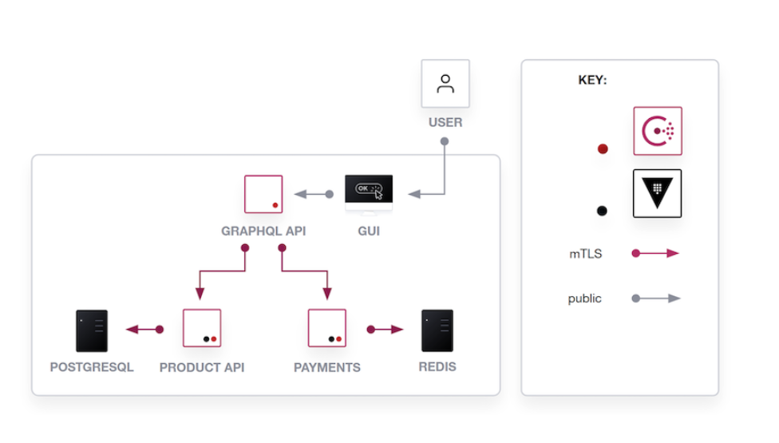
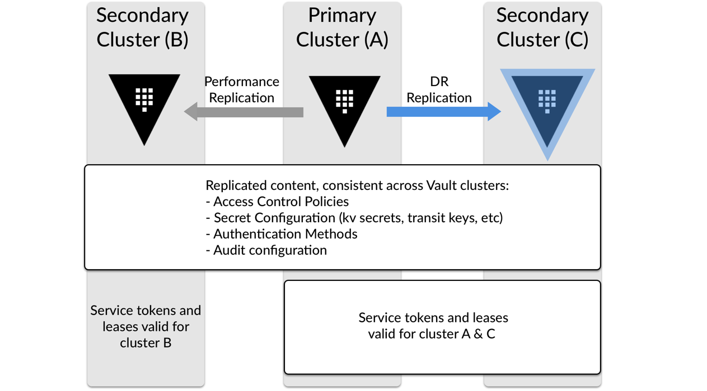

# Vault-Land-Demo
- [Vault: High Availability Across Clouds and Regions](https://play.instruqt.com/hashicorp/tracks/vault-high-availability-across-clouds-and-regions)
- [Demo Script 2](https://docs.google.com/document/d/1OhD8CjxryzC5WMOvyJN2DGwX8ZPz5uQ_QkAoxHqXr3E/)
- [Slides](https://docs.google.com/presentation/d/1hU01NSleVEHR_ez5ZyRBxRyjwkdjXPVihecMhpuJUvI/edit)


# Setup Demo
* Start [Instruqt Track](https://play.instruqt.com/hashicorp/tracks/vault-high-availability-across-clouds-and-regions) at least 5 mins before

## Tabs
* [Instruqt Track](https://play.instruqt.com/hashicorp/tracks/vault-managing-secrets-and-moving-to-cloud) at least 5 mins before
* [Slides](https://docs.google.com/presentation/d/1MoR5HgSsFCcAWQGBALwYTleGN99z-uoLZUIJNd-UQrI/edit#slide=id.gc0950c5a44_4_1780)

---
# Demo
```bash
cat /vault/vault1/root-token
```

* Get Token
```bash
cat /vault/vault1/root-token
```

* Oh no! Somthing went wrong, lets debug this
```bash
docker container logs product-api
```

* We are using the Vault Agent to automatically authenticate to Vault and retrieve a dynamically generated Database Credential that is then inserted into the configuration file
```bash
vault agent -config=/vault/vault-agent/vault-agent-config.hcl
```

* Lets take a look at vaults logs
```bash
journalctl -u vault1 | grep error
```

* Vault isn't running because the KMS key needed to unseal Vault is gone.

* Lets go back in time and setup replication
```bash
cat /vault/vault1/root-token
cat /vault/vault2/root-token
```
* Enable KV Secrets Engine
* Add a secret


* Setup DR replication secondary token: `vault-east-dr`
* **Create DR Operation Token***
```bash
vault token create -format=json -orphan -type=batch -policy=vault-dr-token | jq -r '.auth.client_token' | tee /vault/dr-batch-token
```

* Oh No! It went down, but this time we have a DR
* Promote DR
* Lets run the *vault agent again to retrieve another DB password
* Show hashicups
* Now lets restore West
* Demote West to secondary
* Get recovery keys that we stored when inisilising the cluster
```bash
cat /vault/vault1/initialization.txt
```
* Generate operation token
* Add west as secondary of east

## tokens
s.5BTYtBye3fKfWm2OQYlqaSTf
s.XjznTfZbegj0SJvUZl9I4VM5
b.AAAAAQKAGkvVUNna1A3D93Bw7A3bA-nn9wT1cZKtdB7Pjce3yqxuGTkHM5M2oosyHukYSak2AUAi4LRE8noy2TwwTVHMqHl-zLW5Tp1D7UywwIfxxyb74HFVB0ka8oYwNBJmKQfvHcVSleqGFw
s.DIuBULXnkEOczRdVHlVmreoH
---
# Description 
Welcome to HashiCups

After implementing Vault, the HashiCups environment currently has:

- 🧑‍💻 A unified secrets workflow following Vault Operations best practices
- 📒 An audit logging trail for secrets usage
- 🔐 Credentials, API keys, and certificates stored in Vault
- ☁ Cloud (AWS/Azure/GCP) KMS integration

But first.. What was Vault again? 🧐

HashiCorp Vault is an API-driven, Cloud Agnostic, Secrets Management platform. It allows you to safely store and manage sensitive data in Hybrid and Multi Cloud environments. You can use Vault to generate dynamic short-lived credentials, and encrypt application data on the fly.

For more information please go to:
- 📄 The Vault Documentation page about [Vault Enterprise Replication](https://www.vaultproject.io/docs/enterprise/replication)
- 🧑‍🏫 The [Vault Learn](https://learn.hashicorp.com/tutorials/vault/disaster-recovery) website for a tutorial

### HashiCups App Architecture Diagram


Let's order some coffee! ☕

In this first challenge we're going to:
- 🤳 Get familiar with the HashiCups Coffee Shop app
- 🔐 Log into the Vault cluster
- 🤝 See Dynamic Secrets in actio

Click start when the environment is ready!
---
☕ The HashiCups Store
Let's get familiar with the HashiCups Store app and see how it works. You can:

- Click, hold & swipe to move around in the shop
- Click the buy button
- Click the fingerprint ID button

### 🖥 Retrieving a root token via Vault Terminal
First we need to get ourselves a root token so we can get full access to Vault.

Click on the `Vault Region West - Terminal` tab and run the following command:
```bash
cat /vault/vault1/root-token
```

The root token will look something like this:
```text
s.TSUbJ7A5SDeqRWuDh9QXwqTQ
```

** Please copy this and paste it somewhere safe, you'll be needing this later. **

### ☁ Logging into the Vault GUI
Let's take a look around inside Vault. Go to the Vault Region West - GUI tab and sign into Vault using the root token you have retrieved in the previous step.

You can see that there are currently 2 Secrets Engines enabled. The [Postgres Database Secrets Engine](https://www.vaultproject.io/docs/secrets/databases/postgresql) and the [Cubbyhole Secrets Engine](https://www.vaultproject.io/docs/secrets/cubbyhole).

Let's see how Vault's Database Secrets Engine can generate short-lived, dynamic database credentials.

Click on the `Vault Browser CLI button`. (Next to the Status button in the top right corner.)
```bash
vault read database/creds/product-api
```

Try running this command a couple of times to see a different key value pair every time.

Click on Status in the top right. You can see that replication is currently not enabled.

Alright, everything is working like it should. Let's go to the next challenge! 🚀

---
**🚨 The application isn't working!? 🚨**

We need to figure out what's wrong and get the service back up, stat! 🧑‍⚕

### Sorry, Machine Out of Order..
🚨 The service is down! 🚨

The app isn't coming up and it's showing an error message! 😨 We need to quickly find out what the problem is and restore the service before we lose even more revenue. 💸

### 🖥 Let's dive into the Terminal
The Vault GUI tab isn't working, but thankfully our trusty terminal is still online, let's start the debugging process.

Head over to the terminal tab and run the following command:
```bash
docker container logs product-api
```

`Error: Unable to connect to database.`

The App can't talk to the database.🤔 But why can't it talk to the database?

### 🔐 Let's try to retrieve another secret.
We are using the Vault Agent to automatically authenticate to Vault and retrieve a dynamically generated Database Credential that is then inserted into the configuration file, /hashicups/conf.json, read by the HashiCups apps.

You can do this by running the following command:
```bash
vault agent -config=/vault/vault-agent/vault-agent-config.hcl
```

That will start outputting a stream of logs, you can interrupt it by hitting `ctrl+c` after about 10 seconds.

It looks like it's throwing an `auth.handler` error, the Vault agent can't seem to reach Vault!

Right, something is seriously wrong.🧐

### 📒 Let's look at the Vault logs
Run the following comand:
```bash
journalctl -u vault1 | grep error
```

Ah, Vault seemed to have `Failed to unseal core`...

We've found the problem.

Vault isn't running because the KMS key needed to unseal Vault is gone.
That means this is irreparably broken. This is going to be an awkward conversation with management..... 😅

### 💡 What could we have done to prevent this?
You guessed it: Setup `Vault Disaster Recovery Replication`. Let's head to the next challenge to figure out how to do that! 🚀
---

### 🛑 Let's stop and take a step back to recap what we've learned so far.
We've seen that running Vault in just a singular Cloud Region could cause:
- 🙅‍♀️ Unnecessary downtime
- 💸 Lost revenue to the business
- 😱 Stress on the DevOps team

In the previous challenge we unfortunately lost access to Vault and all of our data, and ended up with a completely unusable and irreparable environment.

Of course no one wants this to happen!!

### 🕰 Time Machine back to a happier time
In this challenge, the HashiCups environment is exactly like it was in the first challenge, but in this timeline the DevOps team added a Vault cluster in a different region. The environment now looks like:

* 📱 A working HashiCups Coffee Store App
* 👈 A Vault Cluster in Cloud Region West
* 👉 A Vault Cluster in Cloud Region East

### 🧑‍🍳 Adding (Vault) Spice(d Latte) to the mix
The DevOps team is now tasked with making the HashiCups store highly available across multiple geographic regions and availability zones. We are going to:

- 🔑 Retrieve root tokens for both clusters
- 🔏 Enable the KV Secrets Engine, populate it with a secret
- 🗂 Set up DR replication
- 🔐 Retrieve a Batch DR Operation Token

### Let's take a look at the Vault DR Reference Diagram


## 🧑‍🍳 Adding (Vault) Spice(d Latte) to the mix

### 🕰 Time Machines Don't Exist 🕰
Since the downtime disaster from challenge 2, the HashiCups DevOps team had to destroy the whole thing and rebuild everything from scratch - Much to the dismay of the company and its bottom line.

### 🖥 Retrieving Root tokens
Let's retrieve some fresh root tokens for our Vault clusters.

Click on the Vault Terminal tab and run the following 2 commands:
```bash
cat /vault/vault1/root-token
cat /vault/vault2/root-token
```
```text
s.TSUbJ7A5SDeqRWuDh9QXwqTQ
s.nhhf1mbJoLIh8CPN4g5zWWRO
```
**⚠ Please copy the tokens and paste them somewhere safe, you'll be needing them later.**

### ☁ Login to the Vault GUI
Go to the `Vault Region West - GUI` tab and login with the first root token. As you can see, the database and cubbyhole secrets engines are enabled, just like in the first challenge.

### 🕵 Enabling the KV Secrets Engine
Dismiss the `Welcome to Vault pop-up`.

Click on `Enable new engine +`

Select `KV`, click `Next` and click `Enable Engine`.

### 🤫 Populating it with a secret!
In the `Secrets` tab click on `Create secret +`.

Enter a `path` for your secret, input some `key / value` in the boxes, and click `Save`.

Example:
```
Path: HashiCups
Key:  Secret
Value: MyS3cr3t
```

### ☁ Vault Region East
Let's see what is happening in our second Vault cluster.

Go to the `Vault Region East - GUI` tab and login with the second root token.

This Vault cluster only has the `Cubbyhole Secrets Engine enabled`.

That means our 2 Vault clusters are completely seperate from each other.

Let's fix that!

### 🏗 Setting up Vault Disaster Recovery Replication
#### 🥇 Setting up our Primary Cluster
We want to make sure Vault Region West is our primary, as it contains all of our secrets.

Go to the `Vault Region West - GUI tab`, you should still be signed in.

Click on the `Status` button in the top right corner and click `Enable` under `Replication`.

You will see 2 options; `Disaster Recovery (DR)` and `Performance`.

Select `Disaster Recovery (DR)`, make sure the cluster mode is set to `primary` and click `Enable Replication`.

After it's enabled, you should be greeted by a page that includes a `State` box with status `running`.

### 🥈 Setting up our Secondary Cluster
On this page, click `Add secondary` or select the `Secondaries` tab on the current Vault UI screen and then click `Add secondary`.

Give it a useful `Secondary ID` like `vault-east-dr` or whatever you like.

Click `Generate token` and a window will pop up with your activation token.

Click `Copy & Close`.

Now, go to the `Vault Region East - GUI tab`.

Click on the `Status` button in the top right corner and click `Enable` under `Replication`.

Select `Disaster Recovery (DR)` and make sure cluster mode is set to `secondary`.

Paste the Secondary Activation token and click `Enable Replication`.

Select the `Details` tab to see that everything is working as it should. You should see the `Status` box showing `state` set to `stream-wals` and the `connection_state` set to `ready`.

**You have now successfully setup Vault Disaster Recovery Replication 🎉**

But, we're not completely there yet...

### 🧑‍💻 Vault Operator workflow
The next and final step is to prepare yourself with a `DR Operation Token Strategy`.

If your Primary cluster becomes inoperable, and you want to promote a DR Secondary to Primary you will need a DR Operation Token to do so.

As of Vault 1.4 you can create a batch DR operation token, which you can use to promote the DR Secondary Cluster to Primary.

**📣 This is a strategic operation and it is recommended to implement this in your operator workflow, to prepare for unexpected loss of the DR Primary.**

Go to the Vault Terminal tab and run the following command to generate your token:
```bash
vault token create -format=json -orphan -type=batch -policy=vault-dr-token | jq -r '.auth.client_token' | tee /vault/dr-batch-token
```

**🚨 ** Important: Please securely save the output somewhere in case you need to perform the Secondary to Primary promotion! ****

### 🕺 Alright, now we're in business!

Let's go to the next challenge to see how easy the promotion process is!

---
### 🙅 Temporarily Closed for Maintenance
### 🚧 Let's do some promoting!
The HashiCups application is down, Vault Region West is down, but we are prepared for this! 💪 This time, it shouldn't take very long to get the HashiCups service back online.

### 🥇 Promoting to Primary
Click on the `Vault Region East - GUI` tab.

In the `Manage` tab, click the `Promote` button in the `Promote Cluster` box.

Paste in the batch `DR Operation token` you've generated and securely saved in the previous step and click `Promote`.

Give it roughly `10 seconds` for Vault to reload automatically. If it doesn't you can click the `refresh` button inside the Instruqt lab (not the browser tab!)

Login to Vault using the `Vault1 root token` you've retrieved in the previous step. (When we enabled replication between the clusters, that included the tokens of the original primary cluster.)

When you click on the `Secrets` tab, you should see your data in there, including the KV secret you added previously.

### 🧘 Restore the service
Now let's run the `Vault Agent` again do retrieve another dynamically generated database credential, so that the HashiCups app can talk to the database again.

In the terminal, run the following command:
```bash
vault agent -config /vault/vault-agent/vault-agent-config.hcl
```

Let's go to the `HashiCups` tab and hit refresh (in the Instruqt lab, not the browser!)

💪 The service should now be restored.

### Let's head to the next challenge 🎉
---
TODO the last step!!
