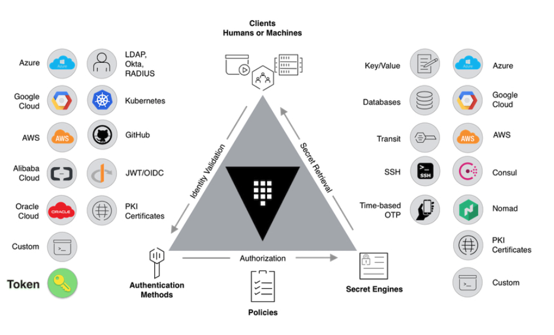

# Vault-Land-Demo
- [Instruqt Track 1](https://play.instruqt.com/hashicorp/tracks/vault-managing-secrets-and-moving-to-cloud)
- [Demo Script 1](https://docs.google.com/document/d/19WCDz3bvXDtkF24OLGBlKSdOrw_W6NLaBzRJC4kRHKw/edit)
- [Slides](https://docs.google.com/presentation/d/1MoR5HgSsFCcAWQGBALwYTleGN99z-uoLZUIJNd-UQrI/edit#slide=id.gc0950c5a44_4_1780)

# Setup Demo
* Start [Instruqt Track 1](https://play.instruqt.com/hashicorp/tracks/vault-managing-secrets-and-moving-to-cloud) at least 5 mins before

## Tabs
* [Instruqt Track 1](https://play.instruqt.com/hashicorp/tracks/vault-managing-secrets-and-moving-to-cloud) at least 5 mins before
* [Slides](https://docs.google.com/presentation/d/1MoR5HgSsFCcAWQGBALwYTleGN99z-uoLZUIJNd-UQrI/edit#slide=id.gc0950c5a44_4_1780)

---
# Demo

- Go direct to **Next**
- I am going to Walk you through a demo on how to manage secrets while moving to the cloud.
- Currently the site is using a password stored in a file

```bash
cat /share/postgres-product-creds.txt
```

- Lets move this password to Vault

```bash
vault kv put kv/db/postgres/product-db-creds \
  username="postgres" \
  password="password"
```

- Lets look at our vault secrets

```bash
vault secrets list

vault kv list kv/db
vault kv list kv/db/postgres

vault read kv/db/postgres/product-db-creds
```

- Now we will leverage the Vault Agent Sidecar Injector for Kubernetes. The Vault Agent leverages the Kubernetes auth method to authenticate, and then injects secrets in a few ways
    - The init container will prepopulate the shared memory volume with the requested secrets prior to the other containers starting.
    - The sidecar container will continue to authenticate and render secrets to the same location as the pod runs. Using annotations, the initialization and sidecar containers may be disabled.
    - At a minimum, every container in the pod will be configured to mount a shared memory volume.
    - This volume is mounted to `/vault/secrets` and will be used by the Vault Agent containers for sharing secrets with the other containers in the pod.
- If we take a look at `products-api.yaml` in our `k8s Dir` **Line 46-48**

```bash
kubectl get deploy

# Lets Restart to pickup the changes
kubectl rollout restart deployment products-api-deployment
kubectl get deploy --watch

# Lets see what it did
kubectl exec -ti deployment/products-api-deployment -- cat /vault/secrets/db-creds

# Now lets get rid of that file
rm /share/postgres-product-creds.txt
```

- Check that the site works
- **Next**
- So far we have used root access for everything, lets solve this
- Show Policies in `Policies Dir`

```bash
vault policy write dba-operator /root/policies/dba-operator-policy.hcl
```

- For humans to access Vault lets enable the Userpass auth method and create some users using our policy

```bash
vault auth enable userpass

# And add a user
vault write auth/userpass/users/dba-dan password=dba-dan policies=dba-operator

# Now login with that new user
unset VAULT_TOKEN
vault login -method=userpass username=dba-dan password=dba-dan

# Now test the user
vault read kv/db/postgres/product-db-creds
vault read kv/not-db/
```

- Now lets fix up that database password with dynamic secrets for Postgress

```bash
vault secrets enable database

# Lets get the current password
vault read kv/db/postgres/product-db-creds

# To make things easier we'll set some VARS
export PG_HOST=$(kubectl get svc -l app=postgres -o=json | jq -r '.items[0].spec.clusterIP')
export PG_USER=postgres
export PG_PASS=password

# And configure the secrets engine
vault write database/config/hashicups-pgsql \
    plugin_name=postgresql-database-plugin \
    allowed_roles="products-api" \
    connection_url="postgresql://{{username}}:{{password}}@$PG_HOST:5432/?sslmode=disable" \
    username=$PG_USER \
    password=$PG_PASS

# Now we have configired the role lets tell it how to create dynamic creds
vault write database/roles/products-api \
    db_name=hashicups-pgsql \
    creation_statements="CREATE ROLE \"{{name}}\" WITH LOGIN PASSWORD '{{password}}' VALID UNTIL '{{expiration}}' SUPERUSER; \
    GRANT SELECT ON ALL TABLES IN SCHEMA public TO \"{{name}}\";" \
    default_ttl="30m" \
    max_ttl="1h"

# And use it
vault read database/creds/products-api

psql -U  -h $PG_HOST products

# Now lets delete that old KV
vault kv delete kv/db/postgres/product-db-creds
```

- Lets update our app to use the new dynamic creds

```bash
kubectl delete deployment products-api-deployment
kubectl get deployment --watch
```

- ********Next********
- Lets update our `products-api.yml` and we’ll **need a new policy**

```bash
sed -i 's/kv\/db\/postgres\/product-db-creds/database\/creds\/products-api/g' /root/k8s/products-api.yml
sed -i 's/kv\/db\/postgres\/product-db-creds/database\/creds\/products-api/g' /root/policies/products-api-policy.hcl

# Write the policy
vault policy write products-api policies/products-api-policy.hcl
```

- Show `products-api.yml`
- Now lets update the app

```bash
kubectl apply -f k8s/products-api.yml
kubectl get deployment --watch

# We can double check what the connection is
kubectl exec -ti deployment/products-api-deployment -- cat /vault/secrets/db-creds
```

- Show that it works


-----
* **Start With Slides 1 - 4 then Skip to [Here](#Instruqt)**
* I am going to Walk you through a demo on how to manage secrets while moving to the cloud.
* HashiCup have been audited by regulators who determined that the HashiCups Store app has a poor secrets management.
* To satisfy the regulators and auditors, HashiCups has decided to adopt Vault
* Our team has been tasked with migrating our legacy secret
* Vault is a tool for securely accessing secrets.
    * such as an API key, password, or certificate.
* Vault provides a unified interface to any secret, while providing tight access control and recording a detailed audit log.
* Two important Vault components we will be using are:
    * **Auth Methods:** Perform authentication and are responsible for assigning identity (and policies) to a user.
    * **Secrets Engines:** Are components which store, generate, or encrypt secrets.
* The following diagram outlines to us the secrets engines and auth methods support in vault
    * AWS, Azure, GCP Credentials
    * Kubernetes, LDAP
    * Database credential, with the capability to provide short-lived credentials for users
    * And many more. 



* The HashiCups Store app itself consists of several different components, all running within Kubernetes. Many of these components require a secret to interact with another component.
    * The first components we'll look at are:
        * `frontend`: A front end web service for displaying HashiCups products.
        * `product-api`: A REST API service abstracting the products database in postgres (Requires credentials to connect to postgres)
        * `postgres`: A PostgreSQL database that contains the HashiCups products

# Instruqt
* Currently we have already deployed all of the components of the HashiCups Store into Kubernetes, and we have already configured the kubernetes auth method in Vault.
```bash 
kubectl get deployments
```
* The kubernetes auth method can be used to authenticate with Vault using a Kubernetes Service Account Token. This method of authentication makes it easy to introduce a Vault token into a Kubernetes Pod.
* **Show HashicCups Store** It looks like we are getting an ERROR when we visit our website

* Let's take a look at our vault secrets path. Everything in Vault is path based, so the first thing you will need to do is find out what path the KV secret is mounted 
```bash
vault secrets list
```

* Notice that the KV secrets engine is mounted at the KV path.. Next you need to list the key to the kv mount until you find the customer profile postgres database credentials
```bash
vault kv list kv/db
vault kv list kv/db/postgres
```

* If we jump into the GUI.. go to Secrets .. we can see our path.. We can dive in more and we can see the username and password.
* Since we entire path we can run 
```bash
vault read kv/db/postgres/product-db-creds
```

* In the CLI to see the credentials
* If we take a look at this.. Something doesn't look correct with the password… 
* Now we understand the path.. We can start fixing our app.
---
* Read Instruqt notes then click **Start**
* If we look at the shared drive we notice the password is different than what is in vault.
* We can fix this by running:
```bash
vault kv put kv/db/postgres/product-db-creds \
  username="postgres" \
  password="password"
```
* Once we have made the updates, we should redeploy the app so that it pulls the latest credentials.
* We will leverage the Vault Agent Sidecar Injector for Kubernetes. The Vault Agent leverages the Kubernetes auth method to authenticate, and then injects secrets in a few ways
    * Two types of Vault Agent containers can be injected: init and sidecar.
    * The init container will prepopulate the shared memory volume with the requested secrets prior to the other containers starting. 
    * The sidecar container will continue to authenticate and render secrets to the same location as the pod runs. Using annotations, the initialization and sidecar containers may be disabled.
    * At a minimum, every container in the pod will be configured to mount a shared memory volume.
    * This volume is mounted to `/vault/secrets` and will be used by the Vault Agent containers for sharing secrets with the other containers in the pod.
* If we take a look at `products-api.yaml` in our `k8s Dir` **Line 46-48**
```bash
kubectl get deploy
kubectl rollout restart deployment products-api-deployment
kubectl get deploy --watch
```
* We can check this worked by looking into the `/vault/secrets/db-creds` in the products-api-deployment container
```bash
kubectl exec -ti deployment/products-api-deployment -- sh
cat /vault/secrets/db-creds
```
* We can now refresh the **HashiCups Store** and see this works
* Now that we’ve migrated the credentials from the old shared file into Vault, we can remove it.
```bash
rm /share/postgres-product-creds.txt
```
---
* Read Instruqt notes then click **Start**
* Lets take a look at the pre-written ACL policies - 
    * one for the `DBA operator` 
    * one for the `HashiCups Products API`. 
* The products-api-policy.hcl file was already used by a setup script
* Show Policys in UI
* Show `policies/dba-operator-policy.hcl` in `Policies Dir`
* Lets write our dba-operator policy..
```bash
vault policy write dba-operator policies/dba-operator-policy.hcl
```

* Show Policys in UI
* Now that both of the required policies are in place for the users and applications, we can enable the Userpass auth method and create some users for that auth method that leverage the policies created.
```bash
vault auth enable userpass
```
* Create a user for `Dan on the DBA team` - call him `dba-dan`, and make sure that he gets the `dba-operator` policy.
* Lets try logging in .. 
```bash
unset VAULT_TOKEN
vault login -method=userpass username=dba-dan password=dba-dan

# Lets Login
vault read kv/db/postgres/product-db-creds
vault read kv/not-db/
```
---
* Read Instruqt notes then click **Start**
* In order to generate dynamic secrets for Postgres, the first thing you'll need to enable is the database secrets engine.
```bash
vault secrets enable database
```

* Once it's enabled, we need to configure it to communicate with the Postgres database. We'll use the credentials that we put in the kv engine earlier in the next step.
* We must also configure the database secrets engine to communicate with the Postgres server.
* Lets use varibales for ease use and clarity
```bash
export PG_HOST=$(kubectl get svc -l app=postgres -o=json | jq -r '.items[0].spec.clusterIP')
export PG_USER=postgres
export PG_PASS=password
```

* Now lets configure Vault
```bash
vault write database/config/hashicups-pgsql \
    plugin_name=postgresql-database-plugin \
    allowed_roles="products-api" \
    connection_url="postgresql://{{username}}:{{password}}@$PG_HOST:5432/?sslmode=disable" \
    username=$PG_USER \
    password=$PG_PASS
```

* Next, you'll have to configure a role in the database secrets engine and associate it with a `CREATE ROLE` statement in Postgres. Here you can also configure things like the default_ttl or max_ttl, which refers to the duration of the lease on the secrets before they expire and are automatically revoked.
```bash
vault write database/roles/products-api \
    db_name=hashicups-pgsql \
    creation_statements="CREATE ROLE \"{{name}}\" WITH LOGIN PASSWORD '{{password}}' VALID UNTIL '{{expiration}}' SUPERUSER; \
    GRANT SELECT ON ALL TABLES IN SCHEMA public TO \"{{name}}\";" \
    default_ttl="30m" \
    max_ttl="1h"
```

* You are now ready to generate dynamic Postgres credentials.
```bash
vault read database/creds/products-api

# Lets test it
psql -U   -h $PG_HOST products
```

* The last thing you want to do is rotate the root credential that you configured the database secret engine with, since you don't want anyone to be able to use that set of credentials again
```bash
vault write -force database/rotate-root/hashicups-pgsql
```

* Now, we can delete the old **KV path**, since we no longer need it.
```bash
vault kv delete kv/db/postgres/product-db-creds
```

* Sicne you have removed the KV path that was being used by the old Products API deployment, you should remove the old Products API deployment altogether. This is because the old deployment has cached results using the old username and password. 
```bash
kubectl delete deployment products-api-deployment

# Lets check
kubectl get deployment
```
---
* Read Instruqt notes then click **Start**
* The Products API deployment that we have been manipulating over the course of this track is located in products-api.yml in the "k8s Dir" tab. Lets open and take a look.
* You need to update the path to reflect the one you created in the last challenge, `database/creds/products-api.`
* You can do this manualy or use the command
```bash
sed -i 's/kv\/db\/postgres\/product-db-creds/database\/creds\/products-api/g' /root/k8s/products-api.yml
```

* Now lets deploy the app
```bash
kubectl apply -f k8s/products-api.yml
```

* This will not be enough to get HashiCups back online, though. The `products-api` policy needs to be updated to reflect the new path the products-api-deployment will be reading from.
* Change the ploicy products-api-policy.hcl to read
```hcl
path "database/creds/products-api" {
  capabilities = ["read"]
}
```

* Then update vault to use the new policy
```bash
vault policy write products-api policies/products-api-policy.hcl
```

* Now we need to restart the deployemnt
```bash
kubectl rollout restart deployment products-api-deployment
kubectl get deployments --watch
```

---
# Description 
You are a DevOps engineer at HashiCups, Inc.

HashiCups has recently been audited by regulators who determined that the HashiCups Store app has a poor secrets management posture. For example, the auditors found secrets for the HashiCups app in plain text in git repos, shared mounts, and spreadsheets.

To satisfy the regulators and auditors, HashiCups has decided to adopt Vault as a centralized secrets management service. Your team has been tasked with migrating from your legacy secrets storage to the new Vault secrets management solution.

Vault is a tool for securely accessing secrets. A secret is anything that you want to tightly control access to, such as an API key, password, or certificate.

Vault provides a unified interface to any secret, while providing tight access control and recording a detailed audit log.

Two important Vault components are used in this track:

* Auth Methods
    * Perform authentication and are responsible for assigning identity (and policies) to a user.
* Secrets Engines
    * Are components which store, generate, or encrypt secrets.

The HashiCups Store itself consists of several different components, all running within Kubernetes. Many of these components require a secret to interact with another component.

The first components we'll look at are:

* `frontend`
    * A front end web service for displaying HashiCups products.
* `product-api`
    * A REST API service abstracting the products database in postgres
    * Requires credentials to connect to postgres
* `postgres`
    * A PostgreSQL database that contains the HashiCups products

On the next note, you can see how all the components interact. Note that Consul is used for service discovery. Don't worry about remembering it all now, we'll address them each in this track.

Your team has already deployed all of the components of the HashiCups Store into Kubernetes, and one of your team members has already configured the kubernetes auth method in Vault.

The kubernetes auth method can be used to authenticate with Vault using a Kubernetes Service Account Token. This method of authentication makes it easy to introduce a Vault token into a Kubernetes Pod.

Because this has already been configured, you don't have to worry about how the Kubernetes pods in the next steps are authenticating to Vault.

---

## Time to Change
The root token for this Vault installation is simply "root". Using the root token, you'll have full access to Vault to begin this challenge. You can log in using the `vault login` command, or using the token in the UI.

Though your team has already deployed all of the components of the HashiCups Store into Kubernetes, when you open up the HashiCups Store tab, you see the app is showing "`Error :(`".

The secrets used to connect each component must not have been migrated over to Vault correctly. You know your team member has already migrated the secret into Vault, but you don't know at what path it is stored.

Everything in Vault is path based, so the first thing you will need to do is find out at what path the kv secrets engine is mounted.
```bash
vault secrets list
```

Notice that the `kv` secrets engine is mounted at the path `kv`/. Next, you need to list the keys of that `kv` mount until you find the Customer Profile Postgres database credentials.
```bash
vault kv list kv
```

Note that there is a key inside the `kv` mount already (db). Continue digging using `vault kv list` to get familiar with path based secrets.
```bash
vault kv list kv/db
vault kv list kv/db/postgres
```

You can also open up the Vault UI tab, type "root" into the Token auth method, and log in to visually browse the kv mount.

Since you know the `products-api` needs to talk to the `postgres` service, you should start there. You can `read` a secret with the read command.
```bash
vault read kv/db/postgres/product-db-creds
```

Something about the password doesn't look right...

Now that you have an idea of how path based secrets are laid out in Vault's `kv` secrets engine, let's start fixing the HashiCups store.

## Migrating Static Database Secrets
The first secret that needs your attention is the credential set for the Products database. These credentials are used by the HashiCups Store's Product API service to pull in all of the products available to consumers.

The credentials are currently stored in a text file on a shared mount. All of your team members at HashiCups have access to this shared mount, and whenever you need to deploy the app, a DBA SSHes into a box, references the file in the shared mount, and updates the app.

When the HashiCups Store was audited, the auditors found, among other things, that the Postgres Products database credentials were clearly visible to all internal team members on a shared drive, at `/share/postgres-product-creds.txt`.

This file is viewable in the "Shared Drive" tab. Noting that what you read in the shared file and what is in Vault do not match, you should make an update to the path in Vault with the right credentials.
```bash
vault kv put kv/db/postgres/product-db-creds \
  username="postgres" \
  password="password"
```

Once you have made the updates, you should redeploy the app so that it pulls the latest credentials.

As noted earlier, you are running everything in Kubernetes, so you will leverage the Vault Agent Sidecar Injector for Kubernetes. The Vault Agent leverages the Kubernetes auth method to authenticate, and then injects secrets in a few ways.

You don't have to worry about how this is set up for now, but you should understand what the containers it can inject do.

Two types of Vault Agent containers can be injected: init and sidecar.

The init container will prepopulate the shared memory volume with the requested secrets prior to the other containers starting. The sidecar container will continue to authenticate and render secrets to the same location as the pod runs. Using annotations, the initialization and sidecar containers may be disabled.

At a minimum, every container in the pod will be configured to mount a shared memory volume. This volume is mounted to /vault/secrets and will be used by the Vault Agent containers for sharing secrets with the other containers in the pod.

You can see where your team specifies the path for the secret if you look inside products-api.yml file, which you can find under the "k8s Dir" tab.

Look for spec -> template -> metadata -> annotations -> vault.hashicorp.com.* to understand what is being read from Vault, and written to the local filesystem.

Look for spec -> template -> metadata -> annotations -> vault.hashicorp.com.* to understand what is being read from Vault, and written to the local filesystem.

Now that you understand how the Vault Agent Sidecar Injector for Kubernetes works, it's time to cycle the deployment and read in the new secrets using the init container. Since we are running all of our components in Kubernetes, we can do that with kubectl.

You can see all of the deployments in your Kubernetes cluster.
```bash
kubectl get deploy
```

You should restart the products-api-deployment, you can do that with a single command.
```bash
kubectl rollout restart deployment products-api-deployment
```

Keep checking the deployment status until it's up and running.
```bash
kubectl get deploy
```

Once the deployment has been restarted, open up the HashiCups Store tab again and refresh the page. You should be able to see one of the HashiCups products now.

Now that you've migrated the credentials from the old shared file into Vault, remove it.
```bash
rm /share/postgres-product-creds.txt
```

Now that the secret is protected by Vault, you've taken one step in the right direction towards good secrets management hygiene.

## Migrating Static Database Secrets
When the HashiCups Store was audited, the auditors found, among other things, that the Postgres Products database credentials were clearly visible to all internal team members on a shared drive, at /share/postgres-product-creds.txt.

This file is viewable in the "Shared Drive" tab. Noting that what you read in the shared file and what is in Vault do not match, you should make an update to the path in Vault with the right credentials.
```bash
vault kv put kv/db/postgres/product-db-creds \
  username="postgres" \
  password="password"
```

Once you have made the updates, you should redeploy the app so that it pulls the latest credentials.

As noted earlier, you are running everything in Kubernetes, so you will leverage the Vault Agent Sidecar Injector for Kubernetes. The Vault Agent leverages the Kubernetes auth method to authenticate, and then injects secrets in a few ways.

You don't have to worry about how this is set up for now, but you should understand what the containers it can inject do.

Two types of Vault Agent containers can be injected: init and sidecar.

The init container will prepopulate the shared memory volume with the requested secrets prior to the other containers starting. The sidecar container will continue to authenticate and render secrets to the same location as the pod runs. Using annotations, the initialization and sidecar containers may be disabled.

At a minimum, every container in the pod will be configured to mount a shared memory volume. This volume is mounted to /vault/secrets and will be used by the Vault Agent containers for sharing secrets with the other containers in the pod.

You can see where your team specifies the path for the secret if you look inside products-api.yml file, which you can find under the "k8s Dir" tab.

Look for `spec -> template -> metadata -> annotations -> vault.hashicorp.com.*` to understand what is being read from Vault, and written to the local filesystem.

Now that you understand how the Vault Agent Sidecar Injector for Kubernetes works, it's time to cycle the deployment and read in the new secrets using the init container. Since we are running all of our components in Kubernetes, we can do that with `kubectl`.

You can see all of the deployments in your Kubernetes cluster.
```bash
kubectl get deploy
```

You should restart the products-api-deployment, you can do that with a single command.
```bash
kubectl rollout restart deployment products-api-deployment
```

Keep checking the deployment status until it's up and running.
```bash
kubectl get deploy
```

Once the deployment has been restarted, open up the HashiCups Store tab again and refresh the page. You should be able to see one of the HashiCups products now.

Now that you've migrated the credentials from the old shared file into Vault, remove it.
```
rm /share/postgres-product-creds.txt
```
Now that the secret is protected by Vault, you've taken one step in the right direction towards good secrets management hygiene.

## Restricting Access to Secrets Using ACLs
Vault centrally secures, stores, and controls access to secrets across distributed infrastructure and applications, so it is critical to control permissions before any user or machine can gain access.

Vault uses policies to govern the behavior of clients and implements Role-Based Access Control (RBAC) by specifying access privileges (authorization). Vault supports both ACL policies and Sentinel policies.

This challenge focuses on ACL policies.

When you first initialize Vault, the root policy is created by default. The root policy is a special policy that gives superuser access to everything in Vault. This allows the superuser to set up the initial policies, auth methods, etc.

This is the policy you have been using up until now.

Since Vault enforces the principle of "least-privileged access" you should scope the access to be as limited as possible.

As you have already seen - everything in Vault is path based.

Admins write policies to grant or forbid access to certain paths and operations in Vault. Vault operates on a secure by default standard, and as such, an empty policy grants no permissions in the system.

There are two primary roles that need to access the Customer Profile database: DBAs (`dba-operator`) and the Products API (`products-api`) itself. The DBAs should be able to perform all operations on the kv/database/ path. The web service should only be able to read secrets at that path.

You have been provided with pre-written ACL policies - one for the DBA operator and one for the HashiCups Products API. You can find them in the "Policies Dir" tab.

The `products-api-policy.hcl` file was already used by a setup script in the first challenge to create the products-api policy in Vault since it was needed to fix the HashiCups app in the previous challenge.

Once you understand the policies, write the `dba-operator` policy to Vault.
```bash
vault policy write dba-operator /root/policies/dba-operator-policy.hcl
```

Now that both of the required policies are in place for your users and applications, you should enable the Userpass auth method and create some users for that auth method that leverage the policies you just created.
```
vault auth enable userpass
```

Create a user for Dan on the DBA team - call him `dba-dan`, and make sure that he gets the `dba-operator` policy.
```bash
vault write auth/userpass/users/dba-dan password=dba-dan policies=dba-operator
```

Now that the user is created and configured with the right policy, you should log in with the `dba-dan` user and confirm the policies are correctly applied. Before you do that, you'll have to unset the `VAULT_TOKEN` environment variable, otherwise it will take precedence over the login operation you are about to perform.
```bash
unset VAULT_TOKEN
vault login -method=userpass username=dba-dan password=dba-dan
```

Note the policy after logging in. Since you have logged in with the DBA user, you should be able to read the secret from the kv/db/* path, but not from any other path.
```bash
vault read kv/db/postgres/product-db-creds
vault read kv/not-db/
```

If you can read the credentials but get denied on the `not-db` path, you have successfully set up the DBA Operator ACLs.

## Static to Dynamic Database Secrets
In order to generate dynamic secrets for Postgres, the first thing you'll need to enable is the database secrets engine.
```bash
vault secrets enable database
```

Once it's enabled, we need to configure it to communicate with the Postgres database. We'll use the credentials that we put in the kv engine earlier in the next step.
```bash
vault read kv/db/postgres/product-db-creds
```

With the credentials fresh in mind, you must configure the database secrets engine to communicate with your Postgres server. You'll need to get the Cluster IP for the Postgres database, and you should also set the PG_USER and POSTGRESS_PASS variables for easy of use and clarity..
```bash
export PG_HOST=$(kubectl get svc -l app=postgres -o=json | jq -r '.items[0].spec.clusterIP')
export PG_USER=postgres
export PG_PASS=password
```
```bash
vault write database/config/hashicups-pgsql \
    plugin_name=postgresql-database-plugin \
    allowed_roles="products-api" \
    connection_url="postgresql://{{username}}:{{password}}@$PG_HOST:5432/?sslmode=disable" \
    username=$PG_USER \
    password=$PG_PASS
```

Next, you'll have to configure a role in the database secrets engine and associate it with a CREATE ROLE statement in Postgres. Here you can also configure things like the default_ttl or max_ttl, which refers to the duration of the lease on the secrets before they expire and are automatically revoked.

```
vault write database/roles/products-api \
    db_name=hashicups-pgsql \
    creation_statements="CREATE ROLE \"{{name}}\" WITH LOGIN PASSWORD '{{password}}' VALID UNTIL '{{expiration}}' SUPERUSER; \
    GRANT SELECT ON ALL TABLES IN SCHEMA public TO \"{{name}}\";" \
    default_ttl="30m" \
    max_ttl="1h"
```

You are now ready to generate dynamic Postgres credentials.
```bash
vault read database/creds/products-api
```

Confirm that you can connect to Postgres with these credentials by plugging the response values into the below command. Enter the generated password when prompted.
```bash
psql -U <YOUR_GENERATED_USERNAME> -h $PG_HOST products
```

If you can successfully log in, then you have successfully configured Vault for dynamic database credentials and are ready to move on.

Exit `psql` by typing `\q`.

The last thing you want to do is rotate the root credential that you configured the database secret engine with, since you don't want anyone to be able to use that set of credentials again.
```bash
vault write -force database/rotate-root/hashicups-pgsql
```

Confirm that you can no longer login with the credentials as before, typing "password" when prompted for the password of the postgres user.
```
psql -U postgres -h $PG_HOST
```

Now, you can delete the old path, since we no longer need it.

vault kv delete kv/db/postgres/product-db-creds
Sicne you have removed the KV path that was being used by the old Products API deployment, you should remove the old Products API deployment altogether. This is because the old deployment has cached results using the old username and password. Don't worry, you'll create a new one in the next challenge.
```bash
kubectl delete deployment products-api-deployment
```

Confirm the Products API deployment has been deleted.

kubectl get deployment
You should no longer see products-api, and if you refresh the HashiCups Store tab, it should be showing Error :( again. You'll fix this in the next challenge.

You have successfully configured Vault for dynamic secrets, and eliminated another potential security issue by deleting the old credentials and rotating them in Vault.

## Vault Agent with Kubernetes
The Products API deployment that you have been manipulating over the course of this track is located in `products-api.yml` in the "k8s Dir" tab. Open it up and take a look.

Look around for the string `agent-inject`. You'll notice a reference to a path to read from Vault, and a template file that will be written to the host Vault is deployed on.

You need to update the path to reflect the one you created in the last challenge, database/creds/products-api.

You can do that manually, or you can use this quick one-liner below, once you understand what you're doing with this command.
```bash
sed -i 's/kv\/db\/postgres\/product-db-creds/database\/creds\/products-api/g' /root/k8s/products-api.yml
```

Update the deployment in Kubernetes.
```bash
kubectl apply -f k8s/products-api.yml
```

This will not be enough to get HashiCups back online, though. The products-api policy needs to be updated to reflect the new path the products-api-deployment will be reading from.

Remembering what you learned about ACLs earlier in this track, modify /root/policies/products-api-policy.hcl and update the products-api policy in Vault to reflect the new path it should have access to read from. Open up /root/policies/products-api-policy.hcl and make it reflect the below policy.
```bash
path "database/creds/products-api" {
  capabilities = ["read"]
}
```

Once again, there is a one-liner you can use to achieve this.
```bash
sed -i 's/kv\/db\/postgres\/product-db-creds/database\/creds\/products-api/g' /root/policies/products-api-policy.hcl
```

You'll then need to upload your changes to Vault.
```bash
vault policy write products-api policies/products-api-policy.hcl
```

Restart the deployment one last time.
```bash
kubectl rollout restart deployment products-api-deployment
```

Run `kubectl get deploy` until the products-api-deployment is ready.

You should now be able to refresh the HashiCups UI and see the products. You are now using dynamic credentials, and the root credentials are no longer known by anyone on your team.